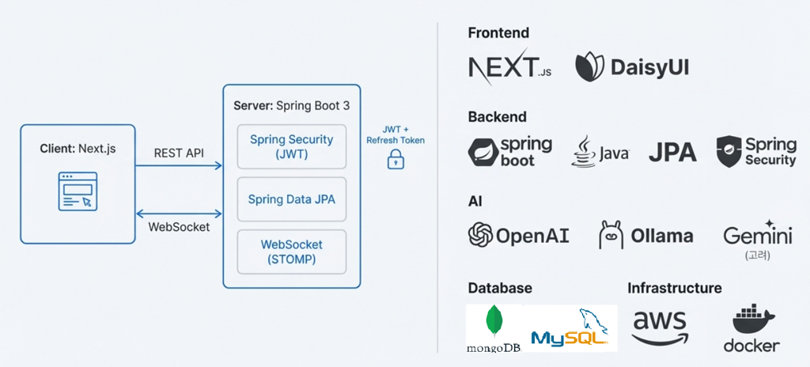
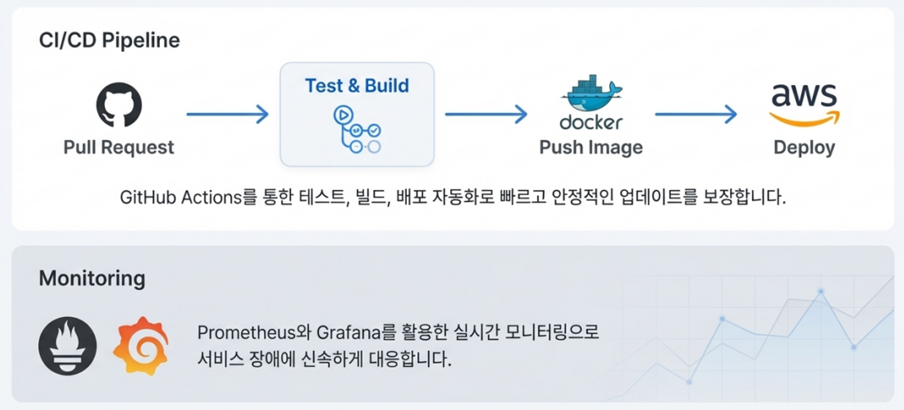

# MixChat - 실시간 AI 번역 채팅 & 커뮤니티


> MixChat은 실시간 채팅에 AI 번역·피드백, 커뮤니티 게시판, 학습 노트를 결합한 영어 학습/언어 교환 서비스입니다.<br>대화 맥락과 사용자 노트를 RAG로 묶어 개인화된 도움을 주고, 커뮤니티/친구/알림까지 한 번에 제공합니다.

- 서비스: [mixchat](https://mixchat.site)
- API Docs: [Swagger UI](http://localhost:8080/swagger-ui/index.html)

---

## 📌 목차
- [🤝 팀원 소개](#팀원-소개)
- [📝 프로젝트 소개](#프로젝트-소개)
- [🧩 아키텍처](#아키텍처)
- [🚀 주요 기능](#주요-기능)
- [🛠️ 기술 스택](#기술-스택)
- [📁 폴더 구조](#폴더-구조)
- [⚡ 성능·운영 개선 포인트](#성능·운영-개선-포인트)

---

## 🤝 팀원 소개

<table>
  <tr>
    <!-- 프로필 사진 -->
    <td align="center">
      <a href="https://github.com/inti0">
        
      </a>
    </td>
    <td align="center">
      <a href="https://github.com/chan808">
        
      </a>
    </td>
    <td align="center">
      <a href="https://github.com/yhcho14">
        
      </a>
    </td>
    <td align="center">
      <a href="https://github.com/Leere1">
        
      </a>
    </td>
  </tr>
  <tr>
    <!-- 이름 -->
    <td align="center">
      <a href="https://github.com/inti0"><b>김희수</b></a>
    </td>
    <td align="center">
      <a href="https://github.com/chan808"><b>김찬종</b></a>
    </td>
    <td align="center">
      <a href="https://github.com/yhcho14"><b>조용현</b></a>
    </td>
    <td align="center">
      <a href="https://github.com/Leere1"><b>이록은</b></a>
    </td>
  </tr>
  <tr>
    <!-- 역할 -->
    <td align="center">FE / BE</td>
    <td align="center">FE / BE</td>
    <td align="center">FE / BE</td>
    <td align="center">FE / BE</td>
  </tr>
</table>

---

## 📝 프로젝트 소개
MixChat은 사용자 간의 실시간 채팅과 AI 기반의 다국어 번역 기능을 제공하는 서비스입니다.    
언어 장벽을 낮추는 **실시간 번역**과, 대화/피드백을 축적하는 **학습 노트**를 기반으로 한 **개인화 AI 튜터(RAG)** 를 통해 글로벌 커뮤니케이션과 외국어 학습을 돕습니다.

---

## 🧩 아키텍처



---

## 🚀 주요 기능
### 💬 실시간 채팅
- 1:1 개인 채팅, 그룹 채팅, AI 튜터 챗봇과의 대화
- WebSocket + STOMP 기반 실시간 메시지 전송
- 메시지/채팅방별 읽음 상태 및 미읽음 수 실시간 동기화
- RabbitMQ 기반 메시지 브로커로 다중 서버 확장성

### 🌐 실시간 AI 번역, 피드백
- Ollama·OpenAI·Gemini를 선택적으로 사용해 실시간 번역(안정성 확보)
- 번역, 피드백, 롤플레이 챗봇 특성에 맞는 적절한 모델 선택으로 토큰 비용 최적화

### 🧠 AI 튜터 챗봇 (RAG)
- 사용자의 학습 노트를 활용한 개인화 컨텍스트 제공
- SQL 기반 컨텍스트 검색 + LLM 응답 생성 (Retrieval Augmented Generation)

### 🔔 소셜 & 알림
- 온라인 상태(Presence) 표시
- 친구 요청/수락/차단, 채팅/게시판 활동 알림

### 📰 커뮤니티 게시판
- 게시글 작성/수정/삭제, 이미지 업로드(S3/MinIO)
- 댓글·좋아요, 조회수·인기/최신 정렬 지원

### 🔐 로그인 및 권한 관리
- JWT 기반 인증/인가
- Spring Security 기반 API 보호
- 관리자 권한을 통한 신고 처리, 방 강제 종료 및 게시글 관리 기능 제공

### 🔎 데이터 검색(Elasticsearch)
- AI 튜터와의 대화, 사용자 학습 노트를 ES에 색인하여 고속 검색 지원
- Prefix 기반 본문 검색으로 채팅방·대화 이력 빠른 탐색 제공

### 📊 관측성·운영 도구
- Spring Actuator + Micrometer → Prometheus → Grafana 대시보드
- 테스트 컨테이너 기반 통합 테스트


---

## 🛠️ 기술 스택
**Language & Framework**  
- Java 21, Spring Boot 3, Spring Web, WebSocket(STOMP), Spring Security (JWT), Spring Data JPA, QueryDSL

**Data**
- MySQL, Redis, MongoDB, Elasticsearch

**AI**
- Spring AI, OpenAI, Ollama (Local LLM), Gemini, RAG, Embedding

**Infra**  
- Docker, Docker Compose, RabbitMQ, AWS S3(로컬 MinIO)

**Observability**  
- Spring Actuator, Micrometer → Prometheus → Grafana

**Build & Tooling**
- Gradle, Testcontainers, Swagger (OpenAPI)

---

## 📁 폴더 구조
```
src/main/java/triplestar/mixchat
├── domain
│   ├── admin
│   ├── ai
│   │   ├── chatbot
│   │   ├── rag
│   │   ├── systemprompt
│   │   └── userprompt
│   ├── chat
│   ├── learningNote
│   ├── member
│   ├── miniGame
│   ├── notification
│   ├── post
│   └── report
└── global
    ├── ai
    ├── cache
    ├── config
    ├── exception
    ├── response
    ├── security
    └── s3
```
